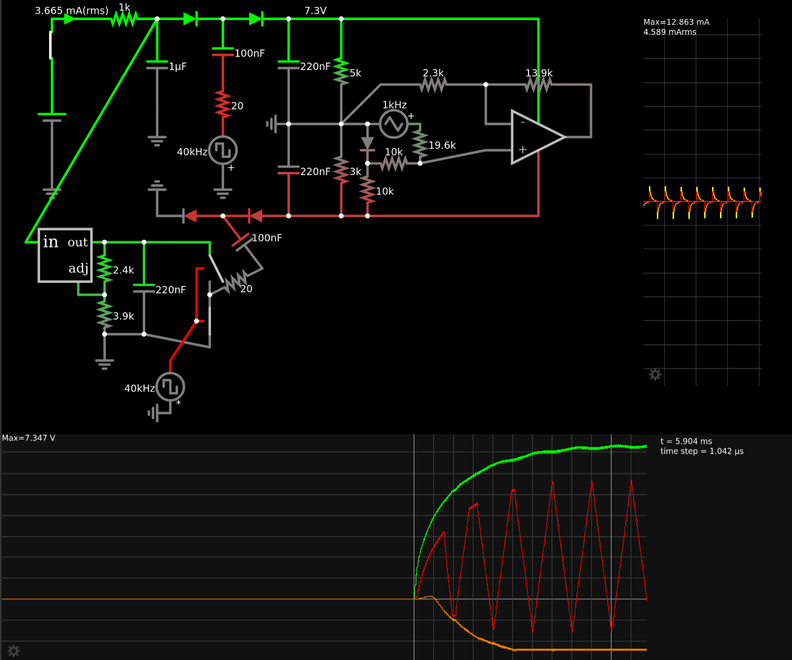
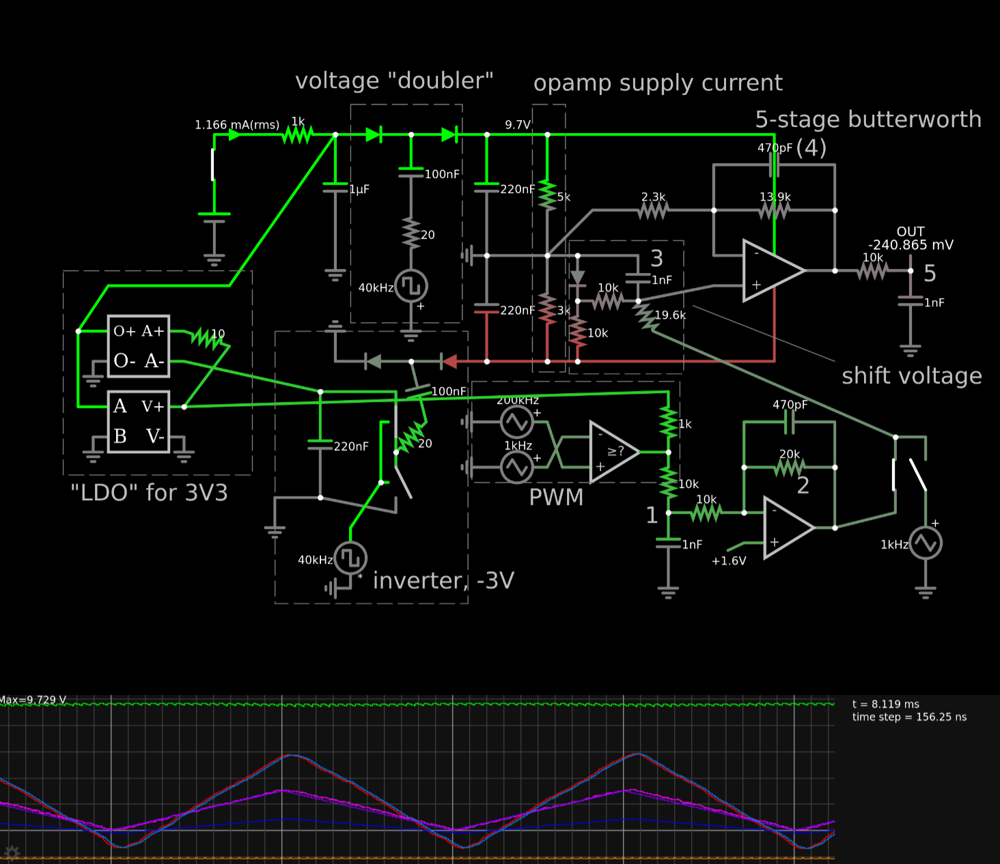

"Completely analog" noise generator
===================================

A friends is very into analog synthesizers. I'm usually more on the digital side.
You can imagine the discussions we sometimes have about this ;-)

He recently baught [this drum synthesizer][1] that supposedly has "some digital
components" but he said that any passive module is "analog enough". What is a
passive module? Anything without a dedicated power supply, i.e. the only power
flowing into it is via its input signals.

Some time later, he mentioned that he doesn't know of any good analog noise generators.

Well.... let the trolling begin :-D

[1]: https://www.errorinstruments.com/a-85227938/bricky-format-standalone-box/po-passive-operator-drum-synth/

## Plan

- MCU
    - internal oscillator (for low power)
    - put into sleep until gate input is high enough
        - TODO: How to do hysteresis? STM32F072 can compare to internal 1.2V reference or 1/4, 1/2 or 3/4
          of that. We could switch between those to adjust threshold.
    - at least to ADC channels, fast enough to sample both inputs with >=50 kHz
    - CRC32 unit might be useful for generating the noise (basically an LFSR).
    - DAC would be great but PWM is ok (but more complex because of filter).
- power: diode rectifier, LDO, MLCC
    - maybe another MLCC on Vbat (if available), MLCC [seems to be good enough][cap-discharge]
- inputs:
    - 1x gate
        - comparator to wake up MCU (IC or something simple)
        - expect +-10 V / 1 kOhm at driver; add 100R on our side
    - 2x input: 10 kOhm and filter, to ADC
    - 1x output: amplify to +-10V if possible, 10 kOhm impedance should be ok for a passive module
- optional:
    - maybe an LED
        - sadly not WS2812 because of 1 mA quiescent current
        - Use high-efficiency LEDs and reduce the current a lot.
    - maybe a button, potentiometer or encoder
    - USB - for ~~programming~~ analog configuring and trolling
    - bootloader:
        - CH23V203: pull PB8 high with VUSB (voltage divider! and solder jumper) or add a button
        - STM32F072: pull BOOT0 high
    - TRNG
    - one or more touch areas, "Theremin", also mix into the noise (if we don't have a TRNG)
        - The MCU even has dedicated hardware for that. Nice! -> Still true after switching to STM.
    - IMS :-D
        - [LIS2DH12TR](https://jlcpcb.com/partdetail/Stmicroelectronics-LIS2DH12TR/C110926)
          is cheap and only consumes some uA. Well... I guess that means yes.
        - There aren't any basic parts in the sensor category, so extended parts fee is more
          than component cost.
        - Typical sample rate ("ODR/2") seems to be 10/2 Hz or 50/2 Hz but can be as high as 5/2 kHz,
          so we could probably use this for input (tilt, then double-tap).
        - We could react to disturbance. We had lots of fun with that feature of a spring reverb :-)
    - small epaper?
        - Doesn't look like a display (i.e. not digital). Can show function of current firmware.
        - Waveshare's 1.9'' epaper has I2C but that is 7-segment, not pixels. The others are as
          complicated as the one that we have used for the Framework 16 project (and they also use
          quite a lot of pins).
        - [This one](https://www.waveshare.com/product/displays/e-paper/2.13inch-touch-e-paper-hat.htm)
          has touch (only five points), maybe a suitable case. Communication is still SPI. Maybe as an optional
          feature instead of LEDs and touch. It is rather large.
- mechanical:
    - "analog noise generator with gate": shrink tube, put in the middle of a patch cable
    - "analog multiplier with gate": Eurorack module cover (3D printed or wood), glue PCB to its back, three jacks
    - 3D printed case in cable, with two parts that can be rotated to set a value
    - LQFP-48 is 9x9 mm with pins (7 mm for body). That is larger than I would like but smaller packages
      are more expensive.

[cap-discharge]: https://www.robotroom.com/Capacitor-Self-Discharge-2.html

- How much power do we have available?
    - 10 V / 1 kOhm is 10 mA. As we use an LDO, that's also true at 3.3 V.
    - MCU need 0.5 mA to 16 mA depending on frequency, so let's stick to lower frequencies.
    - output will provide up to 1 mA at 10 kOhm impedance (plus what the amplifier needs).
    - We should expect to see up to 15 V continuous because 10 V is more like the minimum and
      many modules go up to 1..2 V below there supply of 12 V or 15 V.
- How much delay after the gate is asserted? -> not updated for STM, yet
    - Startup time for oscillator alone is 2.5 ms. Internal HSI needs 10 us.
    - Let's expect a few ms overall and hope for the best.
    - It could be a lot less if gate rises slowly (we can start up before it reaches the
      threshold). In fact, that is our goal and that's why the threshold voltage is near
      the maximum.
- Any PCBs that we can use as reference or even copy?
    - https://github.com/metro94/FlappyBoard
    - I'm not sure which things on the board may be notices according to OHL but we will
      probably only copy the schematic anyway.
    - https://github.com/Jana-Marie/OtterPill
    - Use SY8201?
        - 0.4 mA quiescent current will be 3 mW at 7 V. LDO would waste 11 mW at 7 V.
        - We would have to use lower caps.
        - LDO is simpler+cheaper and good enough, we think.
    - Well, if we use neither SY8201 nor FUSB and we use STM32 symbol from Kicad libraries,
      there isn't anything to copy from OtterPill.
- Which LDO?
    - There don't seem to be any basic parts in category power.
    - More than 15 V (with some margin). Reasonable quiescent current.
    - 5 mA would be 60 mW.
    - [LR8321A-T33](https://www.lcsc.com/product-detail/Linear-Voltage-Regulators-LDO_LR-LR-LR8321A-T33_C5129918.html),
      [vendor page](https://www.lorysemi.com/product/80b8478f710f4a6b9008f729313d2654/a9d765514f14408ab45c6008f1d1d0b4):
      100 mA, 250 mW
- Pinout planning - assuming that we use the QFN28 package. -> This was for CH32.
    - fixed:
        - 4x power
        - 2x crystal
        - 2x BOOT0, nRST  (BOOT0 can be an output after startup)
        - 2x USB
        - 2x SWD ?
        - 1x WKUP?
    - usable:
        - PA1..PA7 (ADC)
        - PB0..PB1 (ADC)
            - PA2..PB1 are also used for the opamps.
            - Touch uses the ADC pins.
            - //Can all ADC inputs be connected to either of the two ADCs? -> We only have one for STM.
        - PA9
        - PA15
        - PB3..PB7
            - PB6 and PB7 are I2C1 (and PB5). PB6 is SCL, which can also be mapped to PB8. I2C is for IMS.
            - PB5 is `I2C_SMBA` (SMBus Alert), which we don't need.
        - summary: 9x ADC, 7x GPIO (including I2C)
    - needed:
        - 2x I2C
        - 1x wakeup+gate -> PA0 (WKUP and ADC0)
        - 2x input (ADC)
        - voltage doubler / inverter
          - 2x positive and negative output rail (ADC, so we know our usable range)
          - 1x input supply (ADC)
            (wakeup is connected to unfiltered gate, i.e. not the same as current voltage in capacitor)
          - 1x inverter for negative rail (PWM)
          - 1x doubler for positive rail (PWM)
          - 2x output signal (ADC)
          - (ADC signals for rails could be used as LED outputs if we don't use high-z and keep the ADC voltages below LED Vf.)
        - 1..2x output (TIM)
        - 1x VUSB detect (BOOT0 cannot be used as an input)
            - Could be the same as e.g. a touch key (which is then not usable while VUSB is present).
        - sum so far: 15 (7 ADC)
        - 0..1x touch (ADC)
        - 4x LED ?
            - [charlieplexing](https://en.wikipedia.org/wiki/Charlieplexing)
            - 12 LEDs with 4 pins. Do we need a resistor per LED? Or half the resistor on each pin?
            - Alternative: Bidir matrix with 8 LEDs.
            - We can use BOOT0 pin but not as three-state.
        - 0x button ?
        - 1x poti ?
- Pinout planning for STM32F072CBT6 (LQFP-48):
    - fixed:
        - 1: VBAT (nice - we have that available here)
        - 3,4: OSC32
        - 5,6: OSC
        - 7: NRST
        - 8,9: analog power
        - 14, 15: DAC
        - 23, 24: power
        - 32, 33: USB
        - 34: SWDIO
        - 35, 36: power
        - 37: SWCLK
        - 44: BOOT0
        - 47, 48: power
    - usable:
        - 2, 10, 11, 12, 13, 16, 17, 18, 19, 20, 21, 22, 26..31, 38..43, 45, 46
        - 26x ^^
    - comparator:
        - outputs are fixed
        - inputs can be on several pins or Vref (1.25V or 1/4, 2/4, 3/4 of that),
          Vref can be connected to negative input
        - COMP1: input is PA1, output is PA0, which is also WKUP
        - COMP output can also go to EXTI, which is also a wakeup source from most modes.
    - I2C:
        - PB10, PB11 (I2C2)
        - PB13, PB14 (I2C2)
        - PB6, PB7   (I2C1)
        - PB8, PB9   (I2C1)
    - SPI:
        - PA4..PA7 (SPI1)
        - PB10, ..?
        - PB12..PB15 (SPI2)
            - PB13: SCK, SCL  -> IMS also has them on the same pin.
            - PB14: MISO, SDA -> IMS has SDA and MOSI on the same pin.
        - PA15 or PB9, PB3..PB5 (SPI1)

### TODO

- Can CH32V2xx run its USB bootloader from internal crystal or should we add an external one?
    - Well, let's add the external one and hopefully not use it (but it doesn't really need
      more power than HSI, to be honest).
    - STM32F072 can definetely do it without the crystal.
- Low-power OpAmp for output or transistor amplifier?
    - Rail-to-rail would be useful. That should be easier with an integrated part.
    - There are lots of low power amplifiers, e.g. [LP358][LP358]. They are below 100 uA.
      Actually, we could tolerate a bit more than that. GBW is often not great but we amplify
      by 6x for audio so ~150 kHz should be fine (or less - depending on how much we filter
      our PWM anyway).
    - The cheapest LM321 on LCSC has 1.2 to 3 mA depending on VCC. That is a bit high but
      should work.
    - The cheapest LM358 on LSCS has below 1 mA even at 36 V. That's good. Output doesn't
      go up to positive rail even at very low current.
    - Cheapest with FET input on LCSC is TL072. It needs ~~a bit over 1 mA~~ per amplifier
      (so maybe try and use the 1x variant) and it goes to within 0.2 V of the rails at
      10 kOhm. Sounds good.
    - TL082 is similar but I just noticed that supply current is 1.4 to 2.8 mA per amplifier
      and that also goes for the TL072 (the figure from before was quiescent current).
    - Well, let's use one of them anyway. That's good enough.
    - We want TL072CDT because that's the only basic part in that category! Supply current is
      2.5 mA max but output swing is 1.5 V below the rails.
    - Actually, the [basic part LM324](https://jlcpcb.com/partdetail/Stmicroelectronics-LM324DT/C71035)
      is quite low-power. How did I miss that before? It will still be 1-3 mA because it has
      4 amplifiers.
    - Downside of LM324 is that its `V_OH` is 1.5 V below the upper rail.
- Can we make a simple TRNG? What sources of entropy do we have?
    - [Infinity Noise](https://github.com/waywardgeek/infnoise) has good documentation but
      3 opamps is a bit much for us.
    - Ring oscillators, e.g. [like this](https://github.com/stnolting/neoTRNG). This is more
      for FPGA but we could use the oscillators of the MCU.
    - Tie unused ADC inputs to half VCC with high impedance.
    - Onchip temperature sensor.
    - Mix in the unique ID.
    - Store previous seed in RTC memory.
    - IMS.
- Connect VBAT?
    - //It would be nice to have the RTC available but dedicated VBAT is only available on the
      larger packages.
    - Alternative: Not much connected to 3.3V supply, diode in series to LDO. Stop and standby
      don't use more current than RTC according to datasheet. Downside: It needs programming
      discipline and we have to power down anything that we connect to that supply (or
      power it through an IO pin).
    - It is available for STM. Yes, let's connect it.
- What do we do about negative voltages?
    - We will usually get a gate signal with 0 V and 10 V, I assume. And we have GND. We can add a
      negative voltage rail but it won't usually be charged.
    - That's not so great because our opamp won't be so great near the negative rail, which will
      be GND in our case.
    - Simple switched capacitor voltage inverter to at least have -2.9 V? -> Probably a good idea.
- How much capacity for power buffer? How to connect it?
    - //Long enough to provide useful time for RTC. MCU and IMS will draw some tens of uA.
        - Starting at 3.3 V. Normal operating range is down to 2.4 V. RTC can work down to
          1.8 V (when powered through VBAT).
        - Example: 1 uF = 50uA*t/(3.3V-2.4V) => t = 0.018 sec => not so great
    - STM32: 2 uA on Vbat with LSE. Works down to at least 1.65 V.
        - Example: 1 uF =  2uA*t/(3.3V-1.65V) => t = 0.8 sec => usable but not great
        - Typical values are more like 1 uA and half that at lower voltage, i.e. let's assume 2 sec.
        - We can use more capacity but we have to be smart about charging it, e.g. GPIO -> diode and resistor -> cap -> diode -> Vbat.
        - If we have 1% duty cycle, we should charge with 100x 2 uA, i.e. 200 uA. Ok, we could do that without controlling it with a GPIO.
          8 kOhm would achieve that but draw 400 uA when the cap is empty but we will lose some
          power through it when drawing current from the cap (but voltage drop is only 20 mV,
          i.e. not an issue and a diode would lose more power).
        - So... 100 nF on Vbat plus maybe 10 uF connected via 10 kOhm.
        - What can we use it for? Store random seed and wakup main MCU (but that needs main power
          anyway).
        - Ok, let's not put too much effort here: Use LSI instead of LSE (although we have no idea
          how much power that costs). 100 nF + 10 + 1 or 10 uF
    - Long enough to switch MCU to low-power mode, e.g. a few ms. Maybe long enough to continue
      working for a few ms to compensate startup delay.
        - Let's plan with 5 mA and 10 ms.
        - Voltage can go from 10 V to 5 V but that will be noticed in the output signal, of course.
        - That would be 10 uF. That is reasonable.
        - However... how long would it take to charge this? tau = 10 ms. Not great.
    - Another issue: We cannot set our gate threshold to 8 V because we will see less voltage
      while we are drawing power or even charging the capacitor.
        - If we draw 5 mA, we will see half the voltage. Not only for the gate but also for the
          capacitor. D'oh!
        - So... it would be good to limit ourselves to 3 mA and not much capacity.
        - The gate should have a large hysteresis.
    - Options?
        - Supply for MCU by DCDC (up to 3x more efficient).
            - If we find cheap DCDCs, we could have a step-down for the MCU, step-up for real 10 V
              and inverter for -10 V. The quiescent currents will add up so that is probably not
              feasible but we can try. -> but opamp would have to be even more power efficient.
            - Step-down: [TPS560200](https://jlcpcb.com/partdetail/TexasInstruments-TPS560200DBVR/C83671)
            - Suggested capacitors are rather high (10 uF) for most DCDCs.
        - Use less power for the MCU. It needs only 0.5 mA at low frequencies.
        - Voltage doubler (and maybe a voltage inverter from the higher voltage instead of MCU pin).
        - Generate output voltage from MCU pin (0 to 3.3V range, only passive filter).
        - Generate output voltage with h-bridge plus passive filter (power consumption to be determined).
            - Example: 10 kOhm plus 5 nF (and maybe 1 kOhm to output). tau=50 us (20 kHz). Current is 1 mA
              at 100 kHz according to Falstad.
            - Even when we add a transistor as a voltage follower, we will need the 1 mA if we want
              10 kOhm output impedance.
            - We may want to add a 2nd filter stage. The one stage has a ripple of +-300 mV!
        - Generate digital signal without much of a filter (only good for hard noise).
            - We should have this as an option.
        - Use an actual low-power opamp.
        - Hope that the opamp is closer to its quiescent current than supply current because our
          signals are slow (but that is still more than 2 mA for the dual opamp).
        - Generate output voltage controlling regulated voltage doubler.
            - This can work because load on the outputs should be fairly constant.
            - To be more precise: We know capacitance at the output and we know how much we transfer
              with each cycle. Thus, we know how many cycles are need for a certain change in output
              voltage. We measure the output voltage to estimate load impedance and compensate. We
              optionally charge through a resistor for a shorter time to adjust by less than a full
              cycle. We also have to adjust for variations in input voltage if we don't use the 3.3V.
            - Downside: This will probably take 4-5 pins per output.
            - Downside: This will only get us a range of -3 to +6 or so.
            - Downside: Unless we add a H-bridge, power will come from LDO/DCDC for 3.3V, i.e. less efficient.
              (or maybe we can avoid that with just one FET and one diode per capacitor..?)
            - VCC will flow to the output through the diodes if we stop the cycles, i.e. we cannot
              output low voltages without an additional switch for VCC.
            - Can we do this with a few MX6208 (L9110 with more suitable specs for this)? -> 22 mA
              for high-z state - no.
            - Can we do it with 3.3 V and 3x GPIO? -> No.
                - [see this simulation][sim1]
                - Reason: The diodes will keep us to within 2x 0.4 V of 0 V / 3.3 V.
                - If we split the GPIO on the right, the simulation will work but ESD diodes will
                  spoil it.
    - Thus: Go with LM324. Keep current for MCU low enough. Maybe boost its supplies with voltage
      doubler / inverter (but only driven by MCU pin).
    - [Simulation][sim2]
        - We can double output swing (but asymmetric).
        - The switched capacitors need rather a lot of current on 3V3 but that shouldn't consume
          much power because the current is symmetric. The actual power comes from the higher VCC.
          We will lose 2x 6 mA in parasitic resistances, though - which should be mostly the FETs
          of the GPIO.
            - See [this simulation][sim3].
        - Startup time is roughly 5 ms, [see here][sim4].
            - 
        - VCVS to convert signal to PWM? [Yes, but very slow][sim5]
        - [Simulation with PWM][sim6]
            - 
            - The 4th stage of the filter doesn't really match the rest, I think.
            - We should remove the "shift voltage" part and adjust the offset in the 2nd filter stage.
            - Offset (voltage shift) and gain should be trim potis because they depend on how well the voltage doubler/inverter are working,
              i.e. we are unlikely to get it right the first time.
            - Add solder jumper for skipping the voltage doubler/inverter.
            - Pins needed:
                - 1x voltage doubler (PWM)
                - 1x inverter (PWM)
                - 2x PWM (1 per output)
                - 2x ADC for rails
                - 1x ADC for VCC
                - 2x ADC for outputs
                - That is a lot!
    - Any MCU with integrated DAC? That would be a lot easier.
        - CH32V3xx, e.g. CH32V305FBP6 for $2
        - CH32F103 for $1.60
        - APM32F072CBT6 for $1.10
        - GD32F303RCT6 for $1.40
        - STM32F072CBT6 for $1.30 - why did I not see this in my previous search? -> Sorting by price is broken.
            - $1 for >= 30 pcs. Could be ok.
        - STM32 low-power - [several series](https://www.st.com/en/microcontrollers-microprocessors/stm32-ultra-low-power-mcus.html)
            - STM32L0: Many have USB, all have 1 or 2 DAC, it seems -> no.
            - [STM32L053](https://jlcpcb.com/partdetail/Stmicroelectronics-STM32L053R8T6/C79207): USB and 1x DAC, $1.7 or $1.4 for 30 pcs
            - [STM32L072](https://jlcpcb.com/partdetail/Stmicroelectronics-STM32L072RBT6/C915968): USB and 2x DAC, $2 is too much
            - F072 is much cheaper than L072. L072 needs about half as much current (if we keep frequency low) and that could be a relevant difference.
            - U series doesn't seem to be available on JLC.
        - Ok, go with STM32L053?
    - External DAC.
        - Many are with I2S but that is only available for CH32V303 or higher. We could maybe use SPI. They also have too much supply current.
        - [GP8102](https://www.lcsc.com/product-detail/Digital-To-Analog-Converters-DACs_Guestgood-GP8102-F50-NH-SW_C5464820.html):
          PWM to analog. 2 mA. $0.80, $0.60 for 30 pcs.
        - [DAC7311](https://www.lcsc.com/product-detail/Digital-To-Analog-Converters-DACs_Texas-Instruments-DAC7311IDCKR_C128601.html):
          150 uA. $0.93, $0.7 for 30 pcs
        - That will be more expensive than larger MCU. We also have to consider cost for extended part.
        - None that I found so far could be connected to the higher voltage.
    - Ok, let's keep things simple: Use [STM32F072CBT6](https://jlcpcb.com/partdetail/Stmicroelectronics-STM32F072CBT6/C81720)
    - We should use 1 uF for the caps.

[LP358]: https://www.ti.com/lit/ds/symlink/lp358.pdf?ts=1717468161669
[sim1]: https://falstad.com/circuit/circuitjs.html?ctz=CQAgjCDsB0AcYCYCsBTAtLcAGaCtYUkgGYtYEA2ATishCS3pABZj70wwAoAN3ERAIEzfgnAJMjMQ3z5w0CknmKQjHMwS8WVCiFIjmO8JF1qWjYtDZmcSLgGNR4zJzHExjMOknRmWZmCwVGABwsGGEDj43AAmgrAuFJ5J4LpiYABySJCcXADmTkIiroJ+qqr52rr6VXp45VhccSXu5UbpWTncjoxGUmTlYNCyI6OyXmh0UcKcSIFIFELuQmBKUVjcBf2SpTZcAE5tuhiezCKeI5Un4Gcg12BUHhWHhrpgJnqwxSkX+A6f3wsX0EkCe63GelwNBoCQ2nEUATWww2lWIwMIbmBNTUXAA7k5WmAUkSKvjescSRRzloSgE3gJ3GZpKNlEohio1L4qJVaSTacwdo1HK1GXUAYNvJCCBRIF9ZUhiAETEjok0xWiRK0zpgOtlcviWvURfVGnE0FT4pgRejwJ19XcLRIdn0uABnXaCAbEYhpAaeEAAMwAhgAbV0oN2W1JAwGDQOh8Oon2eq3JjENPFi7XOFiwHEGiS5qRlPCSTPCbZRok4gBGKZzProQjWXDrFsQiSkFGsrZAeb0ybAxCoLGoFQ0bHTFcEFvcpi4E+jILEyE1xEiC4QbBCmooOoYeg0FQAHjO2MQFnokCOLyORMI9MeADqugDiAAUAJIAeS4AHsbnAco-BobBVDgcp0k1f9wCUVpGBAkchmQcCRloRRFjZQRYL0Lg0XKAAxCA1mwRg0AgAARABXAAXABPF8AGE6PsEMI3wxgiL0MCZFkO4IAI-YUAARyolAADt7DovDEhALiSLAORyJAaj6KYli2Jk1I5IgbdGF4pSBKE0SJKkrggA
[sim2]: https://falstad.com/circuit/circuitjs.html?ctz=CQAgjCAMB0l3ZIBYwDZ0c+g7OGAmOfbbAZkgA59UBOG3AVkhAZCVJYFMBaMMAKABuIbhWZgkSEWJCl8UBUma5mq6A34AnEXNnykFPQsRx+AYzaHdB8JIUx4CFtHylsNSUjqpIqJKlJWB0gBAHNLWykbMGxUe35w0XE7JPBY+OEwfEM0cWyQfHwpZn1HcGhUVjAKoKh1c3B8vnksq3lxWEcurrAeXG5saDFUfAZSclIKBioKGjqEfgATCN1WoxaAOQZsPiXGtoLKdfAtnYELQgPLyIV8Fz6QQdcpqkD6MAYPGiDOsP2Cor-IqqKBaArYeS6YgtHwKJimADu4Mh8muUKEID8emYWMmxQKbDK1Uq5RJag0y2u0KBEIJYFOu2Wa2pNmpm22u3CrNprKU8XCuIoUixShBkAa11yh0M1JK9wGBWgWVifgogWGUxUv34SMldklsPF4QN4hoMLFOuR4FhJtB2mpUrZtOY5ERVrZR1lGPIUilpFQOUNsjwcHKVXU9nqSjmkhy6W2cRiibqcTUkFcJm6XVRlp91pKtKl4qRDCyN1LKNBJbLUNpumLLDL1wrVobLepea9JfSSZYPbLDdj4DLQ6LYNHNcIw-aBXG4u0CenbGiA-ApDNDbk4ibhcNltHZtkAeloOWeb9yBP7LOYM7R07zpDbofqNpXu0-sDLuP11NPnnR4yvel6-k+4puMwqS6NwuirOAoJKBwnzyNwNhkHEoqKEgAD6YDYZA2GEAYeHBCE+FKuuSDELG2BINMdGoNhvDYThkjYaQLEMPhnHsWCazNP8RaHHx+RbpiUhiSU4oWMyhaiVOHRZkpvQKjAVE0EKKCxFk7B5sEAgAPaNNaxiFDQyguNMhC0KgYAUB8YDrvMTg4sZHCkBALoQO5ILkLI-CTLIHAAGKeU+hzwCIEAAEqcAAzgAlnFAAuACGAB2ZicAFVhSKFxiRYQkW8CAsWJSlGVZTlhIgPl4hlPCoYlWVSVpZl2VAA
[sim3]: https://falstad.com/circuit/circuitjs.html?ctz=CQAgjCAMB0l3BWcMBMcUHYMGZIA4UA2ATmIxAUgpABZsKBTAWjDACgBjcMFEFPPLUH9BVMLHiSpcMM3IZY2PITwYUYZWEpqoE9gCcQTbLxFHihPgKh9IbAObnL2BLyYWQ2FTbsA3J1aC7s6uNrw0kuDQhEjiMT7QCJye3mZegi68VDBSEAjQeK44hCiUCNjEPKJ6DnwIzpA0dc5oPmwAJtym1mDE3cIg7QwAZgCGAK4ANgAubADOXXwR4H1L2eAgY5NzDGwA7iumy739UPuLKMc8gWedrLyZF9a8Q2NTs-5MhE10bt+eoXWyyQ6xgSUcXx+JiM-xoNFEZwWVEe-0e6y2OzYhl+NxxaOQcHOeNC6QBWXOpUsZhONzsNFalJu2C8tPAhHOpLMOLMdgOnOszKp1l5KQyJJZuCadgWxlO8NZVAxu2wGCokLJNkeEAgKCxixRTXxaGS9w1ppx2QkMloBTwYDoCBopBcvUIlhykHYjnN0PN8uybAA9uByP8xAgtAhyGBLVK+CHPEGNhAxC6SNQYNr4xBsEnWJ4srRIKQM7BSvHePnc0A
[sim4]: https://falstad.com/circuit/circuitjs.html?ctz=CQAgjCAMB0l3ZIBYwDZ0c+g7OGAmOfbbAZkgA59UBOG3AVkhAZCVJYFMBaMMAKABuIbhWaEKIsSBqoo8pMxrzmMBvwBOI0vhA62k-c0Rx+AYwN7dSSWCRIVseJAgNopcqQYV7DUjR8GXRgEfgBzSzsHG3BsOVVwqXFKJJB8RRUhcHxbVGMctPT5a2dwaFRWMHLWVWh1CzACvl1Gw2Cy506usB5cbmxoOmIPOxpIbAZUDygnAQATS31WqzTwADkGbD5+BeX9CRWWja2BCwP9lKji6HxekAHPAMaadjiXCBCXROX8Ip+MhJaYi6fbYFp5eRMUwAdzSYMOKX2WVQ0RiKJYjWKbFKiBUM3UCwOwOykmJR02212BWJMTJ6wpAgitPhtIBUHMaUuEKJ8PENzu+GgKGwr1IVHwHhIM1CsIOVzlEMgiQVxho4NU7Nl8LQyVygLh6oNRuY5BhRrJKWJSuE5AcOr0qD18g4JmMdTKNXx-EUynstjiLADYCDM3i0olrq6zl0+H4sNt4G52sVcYxLXsaZWSthDExoJBwVTuZjKWLxqLmOJCatRaDAc2cmamrYMSbfsT+vbTZ0xkx4g8Sq0DfAmK7ffA-kIqZ7I5jyYSsK7aodpJSSoWCft1ct9JOmj0yE5hkPVrw8GnJ-hZN5+9Ijo7K6P8jAslMWjvq+PDgOxmc-FI2DMKIJq6Nw+hLOA7KKBwKIgfcPgGBq7AAPpgMhkDIYQNhoZ8LjodAYD+EgxB+iK3hIJMyG8MhSA0aQyH0fY6E0bRpD7ssTYcYqnLsQGHiNnm97JByPzanxd7Pk4UbdHc3CCnQ-hwC8aDpL8NSzPwADOqSyKkRjyAAZgAhgANppnD8GADDKN2h7dkJkGRl0HLgYe+goGGgq3P0eh1LIPiKBQ2BiKgVm6Z8AgoEBtkOLweYIRAAB+AAyACypDBtwgjBAAOpp-R5bhHx5YQ4h5VUULSdGPCEXl3AwGQIoUSMSBxH42CFWk5U1aQhVSY0kANuQFDeJAGWEfgnWQHVYB9fAA1DZQo3jTodUNQBvgtW1AF5YoeWJSZAC2GXYNwACOAAOJncAAgjAxWaVCXWaUgPV9WCHhqo67A0HeTCTZpZWad5tX5QQ1kkIojVBC89BTeVa03BDIrjABMNIHDgPQB9k7ff4f2QADYj7UdJ3nQAdtdd03FAJVwM9FVVZ0IO9WD2MbVZXh5JQYAULQnUAz0vCs+D9C8xSIqNKFFDw-ls1Y-gEPi1skvULziONSgfiTHAFC8-zL3TZpB3HZll1U-dtOPfTAOvcL705K1FHEAE5BTDLgPPSzc3IHwGPjKjYJxHesvy58KCjAHjXEFMqAOz4ZEuxQbtinlxPG6TZuU7dBBWyYz2kFJTNwKQb1s2CdCoNgv2K5AynoALJVlw16T2EMWxVwwKAe6oM0O-YGNqh3Ezdxr+CV9XOhMPXceGyTpunebOc00bT22835RjC8cDBcRKBu43wNl-V5S2r8Y1TC8cSNKHiNTMg593kR18AzAtB14o4w+OkhGQLP6cmzJmdbO1NcqaXzgDQuxdnCl3tuXO8Epfhi2DFMVqh9vZsyQOgFwtA-CUAQQbXuctEZYLyGgGgeDk6oGoDQDWCCdDjxOMHNBc8M4L3OldZeYCIF5SgdAkux8QiVz5nwfwOsghxHQWXKoXhWo6BfBMMEOQXCy14OVdwXcyD4AUZsX4Yh5Ynzrv5UKhEKF5AkbPPabCgGcNAXnG2vCi7F1gaDE+KMJGEwCiI8YUi4GGMaN4DK3gSAVDrkwDqnsjZqLZi4RWycrJBTamEnx5dFAeMdjYUKKSrGALNrY3Oq8HEvWPkgaAI1k4X0aCKRWOhei+NcVUBAcBcx0BcCQHakSEZy1mM0l8YxgyNTqqU8pnhQokRqd5CJADM6LxAQU8qRS+H8JcazNxjp77O0CfQDw9SRY3B0Btagf9x7IBCaosO+yJTVLyNQsYrVJHl3WbaIIWyyCsxyTMjhFsV55TXrtDebyXD41CmqQgESgYYLWSNHI1c-4UJIgwW+jzoVBTGLghF70BymLvC+c+Uyja5Nmd87hiynFMxWXfX6I1vC-WqRQvwuy5oSj-pLQmpUGBdxFlbaJIRmVVyiufQanLKVig5RQWlxF6XvIJZ8pedijY8M0ks6BFK2a0CshUChpBP4BDIIyhWZB+UnBGogHZnTiEGrvCKY1uYxqrLfjQDV1k-A6qCtK+eNjiX2KBsq5xgjsa80VhKIiQQIxcoBhgz4W89bpGEUwVqs8iE8qcNGxog9HTxoeW4wNQRPrOzDbtGV7C5XzOtkDO2oMGq81kWIEUdAKF8H1SfYY1cfCExfGNZOSAkXNsagERQ2ixhim1e9atXda2DwbfLaZxa5k-PAaS-hAi-FVqoLm9gY0wTEXBV7DezhNgoCwWCPWoTFa0PNcm-dksj05DQP9ayGsc0Sg3QBVSESPnFvyfOpgz0K2v2qAEPm1BcwRxPfUgGzaqBbBLo7HFaoe0ECgyYHQPg4P-s1RQIDFQ7B8DA5pGdQCQEkp9WSqqqrDEcpsFgzDfhk6osRZ7CNG8XgctKukflUwMrnL6ixoIRAj1YJGIjIVVHHQjWHfRwtHq8lesKeWje6qxD2CrsFLwgGm3gwAlZSYJzWrEBGghpGWmOW3NOfphjDrebICPap6ymG05FsI7JhZBcaoQarXkMYk8AlkCCOBn2zTlFi0QYRDlkxuNY33UFrYIWvAmcfZ58Yv0fNeFto5mTt0SWud4O5gNiXdHQTiBUfzkW0AoC8zo+NUwIshDKx2rY9AOXIGq+XHUYwCubvQAxj9nrMtWx-evHLo7fMYxFFagCerGNNyGzEu9g1graJjlXMxhmcFME2FQKpOAVtYxVrI+g7Aq4TdZgRrOVMwF-OKXAhqSkgify1oaxNu7rspuhugOweQ9YUSewqn22yJjvawTzb771bvpDgA9u8-90tEq4f1opFa9mARyC81qVlfi0HDdNytr2MqyAmooF8QUe55z+2QF8oUdCE91T3bGnjUdbFDZjhz0nYfyrpgzGqFyUajEVo0IJ47D4MDc3Q9rQd0CK3YIZsgYuluS6R4TjGfOIyUY9qdtnNQSqc94EbcGG6N3iM2BlJ7ANhdxRmkKauYLvAvkmL9Llv3umtTVOMG3Zj7d9Xl8gcghvyfQ9ZxTKmA2A9zAAF7PUJdwMPEfPnR6NhlIhCe85jCtlQfr3NvXwDzuQPO4OiFWatlFIho0iG8l+fnBVpUiF56tlXemles8Kpz-HwC2fG+Fvz4qcqYh6-lS70qq2ltIFc894aru6QgqX3xofFx8sKrYIJs7+w-gTe-JFwrPw6AxFNWIotkrMBAMo6YE-bwd3D5CxvuA2AwYAKu9auPrwO7Bbr8QzQjGYXCb475oVfcvA5AJj-0fHEE-l-zQEfEAI8mdF+mzBWEgIgLAJgNclijAITBgMAI-BEBiAwKVAiHgLkAgJiAXBEBikWELDClnEfDbAgggCck6FTF0n4hkDkE-mbCoILDYAQNTHRHbF0hYJwJAHRDLBiDLCIJIKQPZAAHtshExnwkFmAHg0diJcx35iBlDpQEB5BGwQQDxnQTQ0hlBxBlA2IxQVgAAxD4M8ZILPXgEAAAJU4E0gAEtNIAAXIycmMwCyEw6Ycw58LPKvaKOwhw5wtwjwrwwwZQXw38LPSqQI+wpw1w9wzw-gIAA
[sim5]: https://falstad.com/circuit/circuitjs.html?ctz=CQAgjOB0CsBsBM0CmBaA7OADJenPzTQGZMAOeWATko2kxGhABYiHUwwAoANxBVPq5SfASEqwQ9ek3qVJ87NE4AnPkXgh1zYVvpg8mTgGNtmjU2FgmTBZAN4I0HOUqlYaSkTBpr+SXcwuAHNTKxsLcDQJKU4Q-kEyEUEZBR5weEtYPQyQeHgbQWZ7KFhGMEhS2yUTMByODVqdDT0A+zb7MFQMfjsKfLAvTGtoGTlsB04AE1MtRrNc8AA5aDQOKfSm3MStBuXVrhMheaOw+XgcLpA0HDAaQM9CWDBSEf8JkLm8m0+UmNUCDQ7NANLLyOh4TgAd1ywOO2w08DSsHCEWRDFqZyKBiwCn8SmmRwBGxhCKWKzW00+sIiRN25OCpiJNN+kmMW0yCWERMEF3QuUgTHgYGRRB8K1IUQIb0CUPZ4GscuFMRCJ1BtxBUlZ0KJSsVoMM-1hutpsPoJAh2thtMS3LS0Eo5nEDAdzF0miweCgZRgVU4o2YEW8EhWEiD4H80Te8EG7XaCNlJG+oJ1+tl0Axp3TgOaaYxQOzWvRCMSWZJhdLRMTZcM0JDkWDUXAGJrAcsGOsHNZqg7TezembuSIJBUDEb9VbvfkAwdLfU-YRRtT0J76s0sC5iUM0yruqrhLJ+xHe+2Q2rHotmlPJoXOdURHX4FB943wj04ghd4fR2Pr-PhlF9DxPMKBaLM4YGsS45zLqCQjqcQ6hnmD6wTUOQ6gqCFTq0sZtJ0fIoOcDoWNY1BEOI4j3tEARcAAzkkYgSEBbr0AAZgAhgANjRSCcGA9qTjuSG-hA+g4YYJigaeWhMMKZy8hgRAVHkQxUPkaD4M8EDjDKMmAeOVYoPppDfCAAB+AAyACyXhoCg3DNAAOjR6BOdpgSSE5uCCE55TgmJBjwOwRBOSg2DEMilAyKsLCwMigSubkPlBa5rQcAgMlPFQtQWGpCWYCFYApQYaX9JllDZeQTBoCFYX3kwkWYNFlEyIVNEyE5pkcQAtjZKAAI4AA4cSgACC2BaU54KJW1yU0WFeR1SMsAIctngJfAnmzaFkDPOICDkCM6m1M8eU+TVO2kHtGSIFVgRCqQKXAtGyJLStZHBTRAgdd1vV9QAdsNY04B5NFedNvn+fYgWGR923hVVQ7GZ4dBVdA61JTDKW7U8JB5Fk8CUGQVWnc5rXjZdOP4BQ+CE8Z1XObVyLEEQSNECjaBo21+U0Z1PXeP1Q2jeNINTRtM2Y3NkDAsCgoWJ4wqRcK6Og7N2lkdGgQdp4QzqGLUhnZLeDqyQYSXYmuuPQCstmwrGVOV9PM-fz-2A9gjk0aJ02KZD9hEFt82kJdxkyEMzPIsr0MDJbRAyDjuB0EOrgk4Z0exwM8eYInD0M1LGRB74ocIUwTntY7fO2YNrvA9zosl6rFSExY97AkqhBWBH-sVIMlCHcpdwICTrXbct+g91VffqQPktUEMpDN0KWRt8Xn3c7zv0A0L1c+Z6Yvez7Rud8Q0DqCwHjlUwx8cx3Evbcf0D5IHbOYOm7g98nQ+KGzD9z3QL8eJzcM2Yn1FNQKwl9OalzXs7QWQN3ae13thSGfsb7jBoJ4CUJ8Vhh1gNfKOHtIBsxivVBW0A3CIGzvrUmPkCEjDquVKgpCECkPOpgNBLNiD5CwStEuq8nYVxgW7EG8CnJ733sgvBgDIqkFuNYIcZEhi4NhuMPi3hOFkCFCfQmZMQYpxzoEdMMs6DkHTvVeKOdiBSJkSwROCiubfXLgLKu7ta7izwZQKWaByAvCsFkIcxBSBdEUedTwXwmDLTIAMO+lBB7BN1tYcJ0igH2icu4wgXj0xhMzqKFmgSV72PXk4oRO8RGIP8uIpRUsXqlBsqo1+FDpqRw+uNdw64abClWkMZelDdHNKiAIAm7T5HWHOlEC+1TvC1I8NnSBfDHGb2ccU1xTTc6jE8cZVhl175NIaYfBhz8ojHzCepFYMTzF7JDIc9w+zLarMDqMTZ0Z7a8IcS7eZRTvI0VET7cp50qAxxkGRYE1AECECCYbRAQDJSiQIP-Tm3Sya9DvqKBA0LCA9wAdgP5vhAUE3EDCnh+ToGFO5sIz5pSxI-JzlldwXxyBCgOV0nZEtxrUHQe4PiedOHvyxqylm7L76By5VS+hT0cr0tKMvGZLyBFbw9osr5SDD7PBiggagrD47bLFo0oqAxLpkHJBkVhfFgTcsNrq2mBqBDlRWGLOGyrKK4vVc-D6UrfoyoWR8pg9dVibI5tIkFURPFgu2l5TAEryCEB8AQbZJLzqhvDTCqNxBHq7RWKQ4UML3DZwdlAiuG9YHvK9uSnClK7XGUosKawQY8hgrcvs6R5Bn5PEzvVGOpq63imePHZtMdPDLzLSqytMlJRi1dUSt5NdPXsD1hULIRMhz3XwB4HBc0mW1DjQMKICAablWiu4U5IbN2xVwLiiZRyUqxTwOW9Qzwl3iCeYSvNgM4HyuLbGUt4xx6E1imzYgtTomrq1fXO5Y9Ir32WjJJWq7uY9MgCBkYYGKAxzSiwr9YblorBshQADY7+HEsmosr1zKKgSnUvgdQ6b9C3GDSy4ES1pEqPWVfaDBttq3Do2Ehj6YmNwpI4QPA0ZyEcHuA+suBSJ3by9tOkZaUrnEW-WA3BM77DDFEkYqqqwIVwp0QilTF81NEzblpmT7T1LybDYpuxYnx0jRfVJwytqwqya3fefQ4H6lAYczq9SFB7T43TKwqg9N4XefwKUd8iBR5BZM7FFzzb3MEus3h0aCzppEfXZLTThN1CtJ7pdQUSmWHeEC0-QOc8W73gPco9SFEjGPwqyupzBNM4UCtaQyKYsc2zNebZkWhH67nNIRfNwkVF61oCFEcQZHGotLC41oRRUZtTYMIG-GsUL092fkNxho3Gqidzf1fNgjJ1TuI1QUo53GrUAweQcbeBJs2UarPLbPhTnaQe8VszAhoArC6Q3C774z43c6888TBbua4HBuwBFHCOYeBYGbe097AOTWk+Yocx8DpZHA+3FjHsRkY5ZogbHFBce1QICsSKLNkbAv291-NjAIdQ8MtzFlYTrB0bgH0igjKxbIEMkPcoYTVVeGMhKLn64D1C+PfLMXHMWkUJ2qNjniAJfkHDnkpLh3AZ0GmgdyYAAvPXszDfG4cab7mgwQZW5JYTEG5ARZzvediElJAhH5E9CS0Q3NdKUNIZ7pyppJqexJaGkGHvKFXMobUF3Pk3eW-UkI80lCQ5CP1D5AQAePbp8+SDYWu9oc8tAdI+l1AMjhWVuI1qENIkRRyok7wyt+cZdo0KWe8PLo9yTijlWXnJb0Kp+XxArh+nKzwi3yAkUHQZBIKRRqjCx9o7dpu9M3gZKXSFN4OFI5DISAMrJZ8ZwQ474Pw+XfzBZJmm1gmcwslz8ZULJJGw5+qwthf2fiIh-DBxFkg-+-EQYhoQBdARTxP8cw+I5B9IHxxwWAGhwxRIcJZQnRMInRU8WwYDQJb9ohZQ0QexUDPdYgQA0RSwIhSxACBIpIQCCg0hvxjIywWYCh3QECvQWCpAYBCDaDvgXQGDUheBvx7x6CBCzQthihfJWC8QODtgBDVxMJyDKwBC85NAhCEw6Cqx6o99kJZRFDBIqDWQhQERA5LwbAeDX93QjAAAeAAIycgAH4nI2InIAAuVyQgkwgQ1PWQrsZgZAh8dQ10ZoP8NkPw2A7wiQPwvQVAMYAUYnMNSiDwAYMJZoaiQg4I1Ap0Mg8sUEEI4I3QNkOsXA1ERgpgKWdgQCTFEeZmIcW4e0DmAoZI5cQoicccFsfImwOsZozgOiOAaQLQbozQe+XEdiLiHiLol0EI+0QEAYvQEAIY7iQgiY0I50DQDIlo7ggYvor+TIs0AYw-GCLQ2EHg7QzQgAe3SEfCnDyDt2uETmPm8DnhnwBWlHcj0FYDzEvHkDd1YAJjODkFYAfFYB8HkEBL+ICIQHdHcHkAhKIE4BZnmAADEtJzwRDPRDIQAAAlJAGiAASxogABc2I-ojAeJYShwQAESpxsRQ09J0TMScT8TCTiSdA5ByS9Big-JqSMTsS8SCSiTOAgA
[sim6]: https://falstad.com/circuit/circuitjs.html?ctz=CQAgjOB0CsBsBM0CmBaA7OADJenPzTQGZMAOeWATkoyPhGhABYiHUwwAoANxBVMzgmTPgJCVYIQYKaDKUhdmicATnzogNTUpvqCweTJwDGzHVp1hhiyIbwQ0kUrKYFSV6CzADG2e5wBzMyERbXA0SWlA0X1rfn1YaSkecHhLRNSdeHgRQXpZQyhYRjBIYptlUzA08GrM3QVSu2aWsFQMFANIKyJXVzAiIjR4MAw-TC4AE2CNavN6ejAAOWg0Dk5puYbceZBFlbWuUx3tshCFeBx28TLSYtchxOzMCSlbCeit7JEv2UVVPbDbZAsAZQTQQycADugPoGhO8JSsFCYWRDDqeWYdiwijeymmJwIixqRL24AO602JKBYVJ+1W6yCtJpWT+UWOZ1BeTOpLyV3Qe26ZFgBkId08Bgob38MJOVhEcrB0UV+koizByVlIIyKuSalJXNhRsEJDw0KNdJ5QKMvFgNNedvyGhNWDwUBKMAqnFk8mElgiDADo0kEGwkWl8CIBhaLQW5pIPx12qiMOgdXl6LhenNaazRudObqJ1zxsLCyBCdLqaDAdWIYx5r9tXyYUNRjUTY4Wf0GL2g3bgfrLcsvYGaqMMLoPfL6pTzFbas0sCyZyM00rhsrhPJDK4ai3Zy31tdZsnmAVQLp1oBRGXe0Pzj2bPAEjN+7vCPP950+jsnCGgjxA0KAaLM4B6vUXaQRquAAhmgxDkuP73iY9QGtYCGNO8MatNcKCXM4QwSGg0BEKRlBRqG7xcAAzjE4iSEBzoKAAZgAhgANjRSCcGA0DyFBG51LeyEQNGOGoaBX5aKCFz8rQOCkGgmBpnxEyrM4qzSh8k75LJnSSEwskTg0ladEW15BAZzD6bJTZzigaJgIuYQFnxAnCXeUEsIs4HiTG5qvJhrwFJqzbMKBemROaaJNiFbpGEEaIlmEJZzoJ0lwl+Nrfpoj6kkQj4uuJ7qldIMDKg+PyLoVuTJLIEBpOYd6hSJ4GkAAOjRfFdZ00Bdf5eBdZcLBoEw1CkJQ3hKXgTCwF12BRiMSnjZQTD8a4CD9d1zRSMNmADThbpgAtKQIre+YXS6uDYqUHq+HilXmBdzlwldYUFRdTV5bkAKtS1bqVr+p5YiaX7md2EH-TooU+Y0f6mLDWhuuN4ZtCg8iXJGaQ0ON1SJNoaLjFwTIo-F4K9iZyIyBodbzj+qF07FqJ1UwkBoOwgHYCMTARBMzyo5Q0DQHo1GNiz9PhSZTMiHTUFGHR1MRfQStkXorGcdxnCKzSGiOpoIuNCA7FcTxSX2pI+tpWF+tqyAquG1Tfx27VT5RCMjD4TyfydCSfySgqIBsZwIz0F78yAVsU4XCAAC2ACWAB2AAUbEoAARgANF1RCQEQACU0ThwbYcIneURWYJhsQ0h-xWYSQLF99DkIrgfDfLoLc5J37fdzkXcKj7hJsuajnVWHr0vtmMKdIuk-4X3I8z2iiCMYJbcDjX-d8CvcDw5wbFmDIqUBk2lie3xJ6FHd1DUBp633AMRRXwO2g0-kKPMf5f1iK7dOu9ySEiNf4XX-u9NmHNOj6G6GgTS2NoCkGFlNV4xNGxiDhm-H6YVMGuxwVdHMAZML-yKgQyQf9T5hCMAAJSPswZmMMxBJH9mUXEShzQFXyqQcwjtJIfkPF5DU6N5AoD8AgiiEQowTEwIMCgP4xaTgEWDRMUQ1BywDMUEMAZgZmlMBo8Ils97b30KgYRfg77uGGBtHIiBRb+CSoYv4ejV7-Dano4M9s94ZlDCAAA8gAVQACqcHTu3f2AYUDO0XEYEJ1lt7TQYDUaJ9s6reAWFGZIITnF5CmnsUgrAklGRDNYeAQtcm+GCVPUGNkFgUWSAAD3boMGywjyiuHyE+EAAAiAAMgAER8Z0rqLEAD2Kgc4ADUiCcAaUpTMfYMBpkYIPEASduBIBUAAF3WdnGiIFxnTL2IbPomgDDMAIMwDpAAFAA6gAWQORfDAIw16hA6dwYZHENlsQCEgLqnTJjDIAK7pw4uszpBzEAdEviLCAvsLnd2GQABzYrHRFXUaKAsRYijiABPLqxhAUqBUEgROGyHl5L2KU4gNSYYdJogAC3jixDZXV3mfO+TxB4g4jSbT2E-IwDS8YdOII1DAyzoAoBol8n5XV06Ao2VslQUJRkbPpQcoYSyWCaEoMfQyHSuANNIksjgDAIQ2VeX3dVYhRgQCIKU0YFqRBTMNb0Bgss7xaWWcnJghcGmwCoOAWZy5qoyA6coYZqRwBo2yDqm4ww7jOEhd8HVYxsLeKsJG1gJAFDZtYCUi48hWABsEAG1gCCFDlqzQ9MimgsAPQMIwKZhUGgADF02FBum6ToIAqFIBovHKVbFE7GB4s2ppbb4Zuk7ZHHtfaB1fOHaO8w8gJ3aPBNibtvb+2DsXZwIAA
